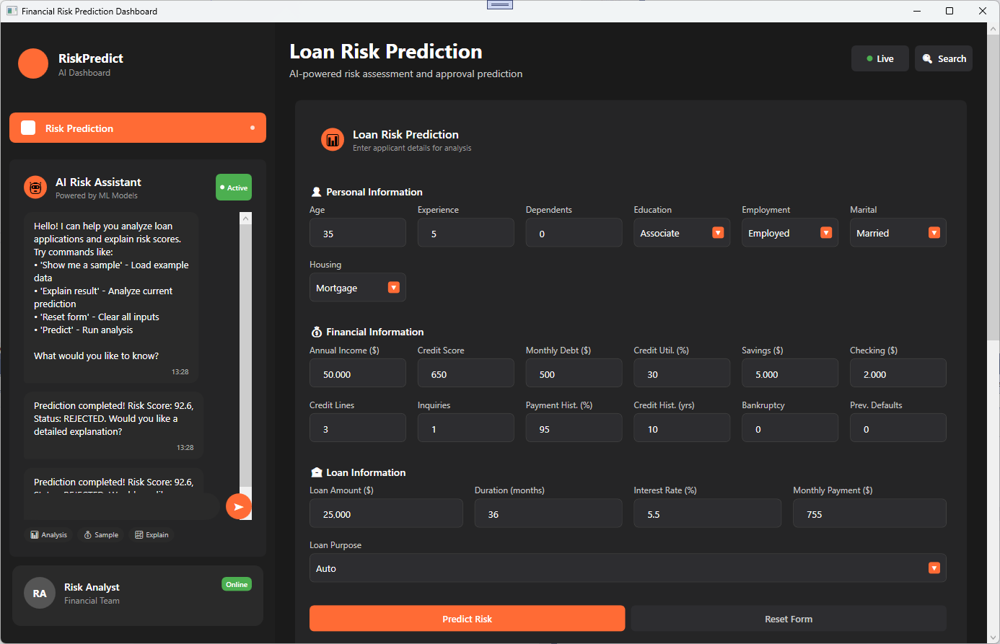
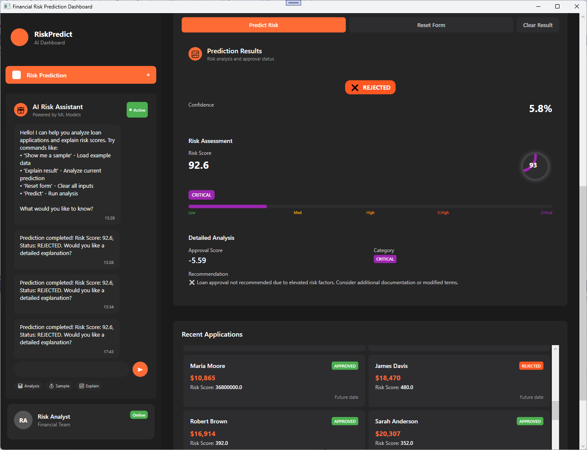

# ML Financial Risk Prediction Platform

|               Screenshot               |               Screenshot                |
| :------------------------------------: | :-------------------------------------: |
|  |  |

## Executive Summary & Project Overview

### 🎯 Project Vision
The ML Financial Risk Prediction Platform represents a cutting-edge solution that revolutionizes loan approval processes through the intelligent application of artificial intelligence and machine learning technologies. This sophisticated system transforms traditional financial risk assessment by providing real-time, data-driven insights that enable financial institutions to make more accurate, consistent, and defensible lending decisions.

### 🚀 Key Innovations

**Intelligent Risk Assessment**: Our platform leverages advanced ensemble machine learning models to evaluate loan applications with unprecedented accuracy, analyzing over 35 distinct financial and personal factors to generate comprehensive risk profiles.

**AI-Powered Assistance**: An integrated conversational AI assistant provides real-time explanations, insights, and recommendations, making complex risk assessments accessible to both financial professionals and applicants.

**Modern Architecture**: Built using SOLID development principles and clean architecture patterns, ensuring scalability, maintainability, and robust performance.

---

## 🏗️ Application Architecture Overview

### Three-Tier Architecture Design

#### **Layer 1: Machine Learning Core Engine**
The foundation of our platform consists of sophisticated ML algorithms that power the risk assessment capabilities:

- **Ensemble Prediction Models**: Combines multiple machine learning algorithms for superior accuracy
- **Real-time Risk Scoring**: Generates risk scores from 0-100 with detailed category classifications (Low, Medium, High, Very High, Critical)
- **Binary Approval Prediction**: Provides clear approve/reject recommendations with confidence levels
- **Feature Engineering**: Intelligently processes and normalizes over 35 data points including credit history, employment status, financial ratios, and behavioral indicators

#### **Layer 2: AI Integration & Intelligence**
Our AI layer transforms raw predictions into actionable insights:

- **Semantic Kernel Integration**: Utilizes Microsoft's Semantic Kernel framework for advanced AI orchestration
- **GPT-4 Integration**: Leverages OpenAI's GPT-4 model for natural language processing and explanations
- **Conversational Interface**: Enables users to ask questions, request explanations, and receive personalized recommendations
- **Contextual Understanding**: AI assistant maintains awareness of current loan applications and provides relevant, contextual responses

#### **Layer 3: Modern User Interface**
A sophisticated WPF desktop application delivering enterprise-grade user experience:

- **Intuitive Form Design**: Streamlined data entry with real-time validation and auto-calculation features
- **Visual Analytics Dashboard**: Rich data visualization with risk gauges, progress indicators, and status cards
- **Integrated Chat Interface**: Seamless AI assistant integration within the main application
- **Responsive Design**: Modern, professional interface optimized for financial professionals

---

## 🧠 Artificial Intelligence & Machine Learning Implementation

### Advanced ML Methodologies

**Ensemble Learning Approach**
- Combines multiple specialized models for enhanced prediction accuracy
- Risk Score Model: Regression-based analysis using LightGBM algorithms
- Loan Approval Model: Binary classification with probability scoring
- Feature importance weighting for transparent decision-making

**Data Processing Excellence**
- Sophisticated feature engineering with categorical encoding and normalization
- Handles missing data intelligently with robust preprocessing pipelines
- Real-time data validation and consistency checking
- Statistical normalization for optimal model performance

### AI-Enhanced User Experience

**Conversational Intelligence**
- Natural language queries about loan applications and risk factors
- Contextual explanations of risk scores and approval decisions
- Sample data generation for testing and demonstration purposes
- Intelligent recommendations based on application analysis

**Smart Automation**
- Automatic calculation of derived financial metrics
- Real-time risk category classification
- Intelligent form validation and error prevention
- Predictive field completion based on historical patterns

---

## 🏛️ SOLID Development Principles Implementation

### Single Responsibility Principle (SRP)
Each component has a clearly defined, single purpose:
- **DataLoader**: Exclusively handles CSV data ingestion and parsing
- **FeatureEngineer**: Focuses solely on data transformation and feature preparation
- **ModelEvaluator**: Dedicated to model performance assessment
- **EnsemblePredictor**: Manages prediction orchestration across multiple models

### Open/Closed Principle (OCP)
The architecture enables extension without modification:
- Interface-based design allows new model types without core changes
- Plugin architecture for adding new AI capabilities
- Extensible prediction pipeline supporting additional algorithms
- Modular UI components for feature expansion

### Liskov Substitution Principle (LSP)
Consistent interfaces ensure reliable component substitution:
- All trainers implement common interfaces for seamless swapping
- Prediction engines follow consistent contracts
- Service layer abstractions enable implementation flexibility

### Interface Segregation Principle (ISP)
Focused interfaces prevent unnecessary dependencies:
- Separate interfaces for different model types (regression vs. classification)
- Distinct service contracts for data loading, training, and prediction
- Specialized UI service interfaces for different application concerns

### Dependency Inversion Principle (DIP)
High-level modules depend on abstractions, not implementations:
- Dependency injection throughout the application
- Service registration and lifecycle management
- Testable architecture through interface-based design

---

## 📊 Business Value & Impact

### Operational Excellence
- **Reduced Processing Time**: Instant risk assessment replacing lengthy manual reviews
- **Consistency**: Eliminates human bias and ensures uniform evaluation criteria
- **Scalability**: Handles high-volume loan processing with consistent performance
- **Audit Trail**: Complete transparency in decision-making processes

### Financial Benefits
- **Improved Accuracy**: Advanced ML models reduce false positives and negatives
- **Risk Mitigation**: Better identification of high-risk applications before approval
- **Cost Reduction**: Automated processing reduces operational overhead
- **Competitive Advantage**: Faster decision-making improves customer experience

### Regulatory Compliance
- **Transparent Decisions**: Clear explanations for all approval/rejection decisions
- **Consistent Criteria**: Standardized evaluation reduces discriminatory practices
- **Comprehensive Documentation**: Detailed logging for regulatory review
- **Explainable AI**: Human-interpretable reasoning for all predictions

---

## 🔧 Technical Excellence Features

### Performance & Scalability
- **Optimized Algorithms**: LightGBM implementation for fast, accurate predictions
- **Efficient Data Processing**: Streamlined pipelines for real-time performance
- **Memory Management**: Careful resource handling for enterprise deployment
- **Batch Processing**: Support for high-volume application processing

### Security & Reliability
- **Data Protection**: Secure handling of sensitive financial information
- **Error Handling**: Robust exception management with graceful degradation
- **Validation**: Comprehensive input validation preventing data corruption
- **Logging**: Detailed audit trails for compliance and debugging

### User Experience Innovation
- **Intuitive Interface**: Professional design optimized for financial workflows
- **Real-time Feedback**: Instant validation and calculation updates
- **Contextual Help**: Integrated AI assistant providing on-demand guidance
- **Visual Clarity**: Clear risk indicators and decision summaries

---

## 🎯 Future Enhancement Opportunities

### Advanced Analytics
- **Trend Analysis**: Historical pattern recognition for market insights
- **Portfolio Risk Assessment**: Aggregate risk analysis across loan portfolios
- **Predictive Market Modeling**: Economic factor integration for enhanced accuracy

### Enhanced AI Capabilities
- **Multi-language Support**: Expanded accessibility for global markets
- **Voice Interface**: Natural language voice commands and responses
- **Advanced Explanations**: Deeper insights into model decision factors

### Integration Possibilities
- **API Development**: RESTful services for third-party integration
- **Cloud Deployment**: Scalable cloud infrastructure for enterprise use
- **Mobile Applications**: Companion mobile apps for field assessment

---

## 📈 Conclusion

The ML Financial Risk Prediction Platform represents a paradigm shift in financial technology, combining the power of modern artificial intelligence with proven software engineering principles. By implementing sophisticated machine learning algorithms within a robust, scalable architecture, the platform delivers unprecedented accuracy, efficiency, and insight in loan risk assessment.

The thoughtful application of SOLID development principles ensures that this solution not only meets current business needs but provides a foundation for continued innovation and growth. As financial markets evolve and new regulatory requirements emerge, this platform's flexible, extensible design positions organizations to adapt quickly while maintaining the highest standards of performance and compliance.

This project demonstrates how advanced AI and ML technologies, when properly architected and implemented, can transform traditional business processes while maintaining the reliability, transparency, and security that financial institutions require.